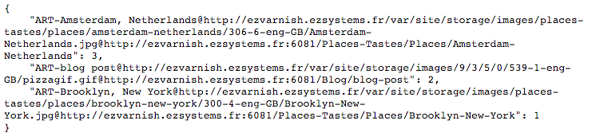

Configuration du VCS
--------------------

Pour l'instance de démo, la configuration du daemon VCS a été modifié comme suit afin de conserver longuement les informations.

```
DAEMON_OPTS="-b 60 -Z -m 500"
```

Pas grand chose de plus à rajouter; en effet VCS récupère et traite automatiquement les headers ```vcs-key```. Pour plus d'informations reportez vous à la [documentation de VCS](http://files.varnish-software.com/pdfs/installation-guide_vcs-latest.pdf).

Afin de récupérer les données de statistiques pour notre application JavaScript, nous allons les récupérer via l'URL du type ```http://example.com:6555/match/%5EART-/top/100?b=100```



Aller à la [Mise en place du LiveViewver](d3.md)
